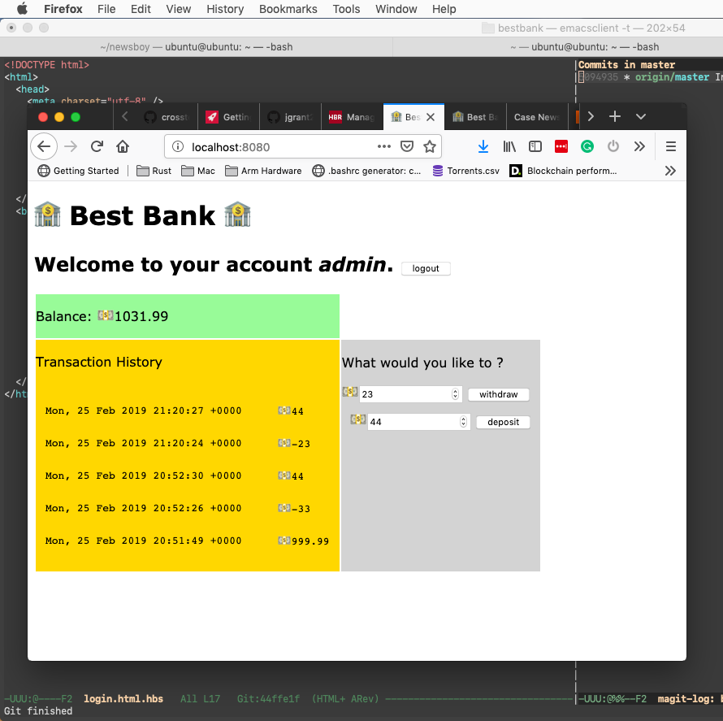

# bestbank

## A small [Rocket](https://rocket.rs) based web app using [Rust](https://www.rust-lang.org) that demonstrates
- Secure Login / Logout.
- Application level temporary memory safe data storage.
- Templating using JSON endpoints for data.
- Websockets.


### Install rust

Follow the [instructions](https://www.rust-lang.org/tools/install) here.

### Set nightly toolchain as the default

```
mbp2008:~ jgrant$ rustup default nightly
info: using existing install for 'nightly-x86_64-apple-darwin'
info: default toolchain set to 'nightly-x86_64-apple-darwin'

  nightly-x86_64-apple-darwin unchanged - rustc 1.34.0-nightly (146aa60f3 2019-02-18)
```

### Run the app

```
mbp2008:bestbank jgrant$ cargo run
warning: unused manifest key: dependencies.rocket_contrib.disable-features
   Compiling bestbank v0.1.0 (/Users/jaybones/bestbank)
    Finished dev [unoptimized + debuginfo] target(s) in 22.71s
     Running `target/debug/bestbank`
🔧 Configured for development.
    => address: 0.0.0.0
    => port: 8080
    => log: normal
    => workers: 4
    => secret key: generated
    => limits: forms = 32KiB
    => keep-alive: 5s
    => tls: disabled
🛰  Mounting /:
    => GET / [2] (index)
    => GET / (user_index)
    => POST /login (login)
    => POST /logout (logout)
    => GET /login (login_user)
    => GET /login [2] (login_page)
    => GET /dump (dump)
    => GET /json/account_info (account_info)
    => POST /json/withdraw (withdraw)
    => POST /json/deposit (deposit)
📡 Fairings:
    => 1 request: Templates
🚀 Rocket has launched from http://0.0.0.0:8080
```

or run it behind SSL

```
mbp2008:bestbank jaybones$ cargo run --release
warning: unused manifest key: dependencies.rocket_contrib.disable-features
   Compiling bestbank v0.1.0 (/Users/jaybones/bestbank)
    Finished release [optimized] target(s) in 20.83s
     Running `target/release/bestbank`
🔧 Configured for production.
    => address: 0.0.0.0
    => port: 8443
    => log: critical
    => workers: 4
    => secret key: generated
    => limits: forms = 32KiB
    => keep-alive: 5s
    => tls: enabled
Warning: environment is 'production', but no `secret_key` is configured
🚀 Rocket has launched from https://0.0.0.0:8443
```

## Log in
User is admin:admin


